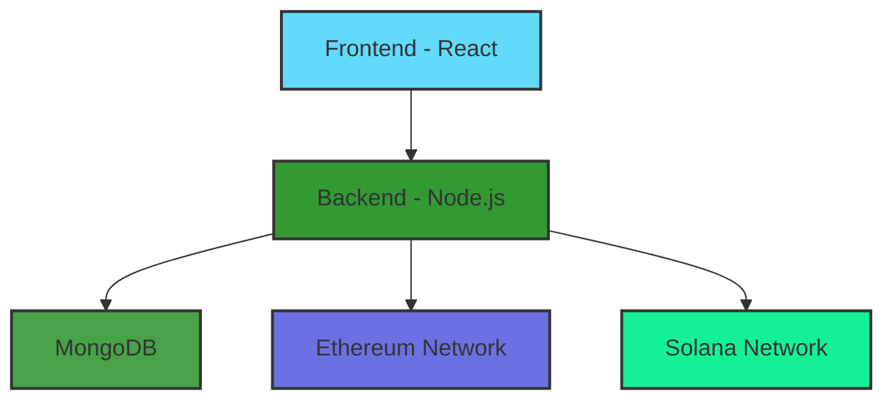

<div align="center">
  

  # ⚡ BonkPay
  <h3>
    <strong>Your Gateway to Multi-Chain Transactions</strong>
  </h3>

  <p align="center">
    Experience seamless crypto management across Ethereum and Solana chains
  </p>

  <br/>

  <div>
    
    
    
    
    
  </div>

  <br/>

  <p align="center">
    <strong>🔒 Non-Custodial</strong> &nbsp;•&nbsp;
    <strong>⚡ Fast</strong> &nbsp;•&nbsp;
    <strong>🛡️ Secure</strong> &nbsp;•&nbsp;
    <strong>🌈 Modern UI</strong>
  </p>
</div>

<div align="center">
  <h2>🎥 Watch BonkPay in Action</h2>
  
  [](https://www.youtube.com/watch?v=SJ6JZ5TfxQk)
  
  <p><em>Click the image to watch the demo video!</em></p>
</div>

## ✨ Features

<div align="center">
  <table>
    <tr>
      <td align="center" width="25%">
        
        <br/>
        <strong>Secure Key Generation</strong>
        <br/>
        <sub>Military-grade encryption</sub>
      </td>
      <td align="center" width="25%">
        
        <br/>
        <strong>ETH Transactions</strong>
        <br/>
        <sub>Fast & secure transfers</sub>
      </td>
      <td align="center" width="25%">
        
        <br/>
        <strong>SOL Transfers</strong>
        <br/>
        <sub>Lightning-quick sends</sub>
      </td>
      <td align="center" width="25%">
        
        <br/>
        <strong>Balance Tracking</strong>
        <br/>
        <sub>Real-time updates</sub>
      </td>
    </tr>
  </table>
</div>

## 🏗️ Architecture



## 💻 Tech Stack

<table>
<tr>
<td>

### 🎨 Frontend
```javascript
{
  "framework": "React 18.2 + Vite",
  "styling": "TailwindCSS",
  "web3": {
    "ethereum": "ethers.js",
    "solana": "@solana/web3.js"
  },
  "state": "React Hooks",
  "api": "Axios"
}
```

</td>
<td>

### ⚙️ Backend
```javascript
{
  "runtime": "Node.js + Express",
  "database": "MongoDB + Mongoose",
  "security": "Bcrypt",
  "networks": {
    "eth": "Sepolia Testnet",
    "sol": "Devnet"
  }
}
```

</td>
</tr>
</table>

## 🚀 Quick Setup

<details>
<summary>📝 Installation Steps</summary>

```bash
# Clone repository
git clone https://github.com/yourusername/bonkpay.git

# Install frontend dependencies
cd bonkpay-frontend
npm install

# Install backend dependencies
cd ../bonkpay-backend
npm install

# Configure environment
cp .env.example .env

# Launch development servers
npm run dev
```
</details>

## 🔐 Security Features

- **Wallet Security**
  - Non-custodial key management
  - Encrypted storage
  - Secure key generation

- **Transaction Security**
  - Real-time validation
  - Status monitoring
  - Balance verification

## 🌐 Connect

<div align="center">
  <a href="https://twitter.com/VagabondBushido">
    
  </a>
</div>

<br/>

<div align="center">
  
  
  <p>
    <sub>Built with 💜 by ME</sub>
  </p>
</div>