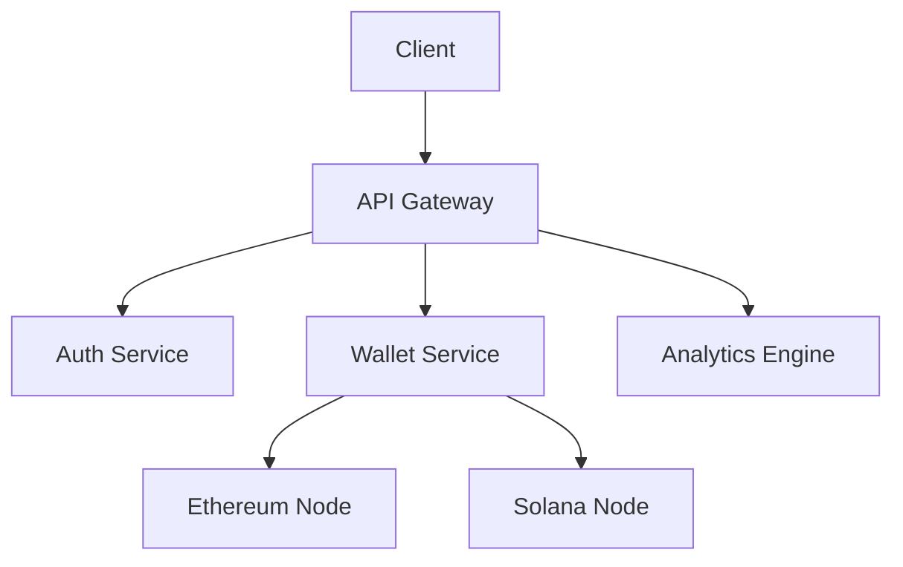

<div align="center">
  

  # 🌐 BonkPay - Next-Gen Multi-Chain Wallet
  
  <p align="center">
    Experience Web3 like never before with our secure, intuitive crypto wallet supporting Ethereum and Solana chains
  </p>

  <div>
    
    
    
    
    
  </div>
</div>

## 📝 Overview

BonkPay revolutionizes the Web3 wallet experience by seamlessly bridging Ethereum and Solana ecosystems. Built for both crypto natives and newcomers, it combines enterprise-grade security with an intuitive interface that makes navigating Web3 feel natural.

<div align="center">
  <h2>🎥 Live Demo</h2>
  <a href="https://www.youtube.com/watch?v=SJ6JZ5TfxQk">
    
  </a>
</div>

## ⚡ Web3 Capabilities

- **🔄 Cross-Chain Swaps**: Seamlessly swap assets between Ethereum and Solana
- **🌉 Bridge Integration**: Native support for Wormhole and other popular bridges
- **🔗 dApp Browser**: Integrated Web3 browser for DeFi interactions
- **🪙 NFT Support**: Full NFT visualization and transfer capabilities
- **⚖️ DeFi Dashboard**: Track your yields and liquidity positions
- **🤖 Smart Contract Interface**: Easy interaction with verified contracts

## 🌟 Core Features

- **🛡️ Military-Grade Security**: 
  - Secure Enclave protection
  - Multi-sig support
  - Hardware wallet integration
  - Biometric authentication
- **📊 Real-Time Analytics**: 
  - Gas fee predictions
  - Price impact calculations
  - Portfolio performance metrics
- **🎨 Modern UX/UI**:
  - Dark/Light themes
  - Customizable dashboards
  - Interactive charts
  - Transaction simulations

## 🏗️ Technical Architecture

### Backend Infrastructure


### Web3 Integration

#### Ethereum Stack
- **Network**: Ethereum Sepolia via Alchemy
- **Features**:
  ```javascript
  {
    "smartContracts": "ERC-20/721/1155",
    "transactions": "EIP-1559 support",
    "gasOptimization": "EIP-1559 + MEV protection",
    "standards": ["EIP-712", "EIP-2612"]
  }
  ```

#### Solana Stack
- **Network**: Solana Devnet
- **Features**:
  ```javascript
  {
    "programs": "Native + SPL",
    "transactions": "Versioned + v0",
    "staking": "Delegated proof of stake",
    "standards": ["Metaplex", "Token-2022"]
  }
  ```

## 💻 UI/UX Features

### Web3-Native Elements
- **Token Lists**: 
  - Curated token directories
  - Real-time price feeds
  - Trading pair analytics
- **Transaction Builder**:
  - Visual transaction composer
  - Batch transaction support
  - Gas optimization suggestions
- **DeFi Components**:
  - Yield farming dashboards
  - Liquidity pool interfaces
  - Staking portals

### Interactive Elements
- **3D Wallet Visualizations**
- **Live Network Stats**
- **Transaction Flow Animations**
- **Price Chart Integration**

## 🚀 Quick Start

1. **Clone & Install**
```bash
git clone https://github.com/yourusername/bonkpay.git
cd bonkpay

# Frontend setup
cd bonkpay-frontend
npm install

# Backend setup
cd ../bonkpay-backend
npm install
```

2. **Configure Environment**
```bash
# Frontend (.env)
VITE_ALCHEMY_KEY=your_key
VITE_SOLANA_RPC=your_rpc

# Backend (.env)
MONGO_URI=your_mongodb_uri
JWT_SECRET=your_secret
```

3. **Launch Development Environment**
```bash
# Start backend (http://localhost:3000)
npm run dev

# Start frontend (http://localhost:5173)
npm run dev
```

## 🛡️ Security Features

- **Wallet Security**:
  - Zero-knowledge proof integration
  - Threshold signatures
  - Time-locked transactions
  - Whitelist management

- **Network Security**:
  - RPC node redundancy
  - Transaction simulation
  - Slippage protection
  - MEV attack prevention

## 🤝 Contributing

We welcome contributions! Check our [Contributing Guidelines](CONTRIBUTING.md) for:
- Code style guidelines
- Pull request process
- Development workflow
- Community guidelines

## 📞 Connect With Us

<div align="center">
  <a href="https://twitter.com/VagabondBushido">
    
  </a>
</div>

---

<div align="center">
  <p>Built with 💜 by ME </p>
</div>